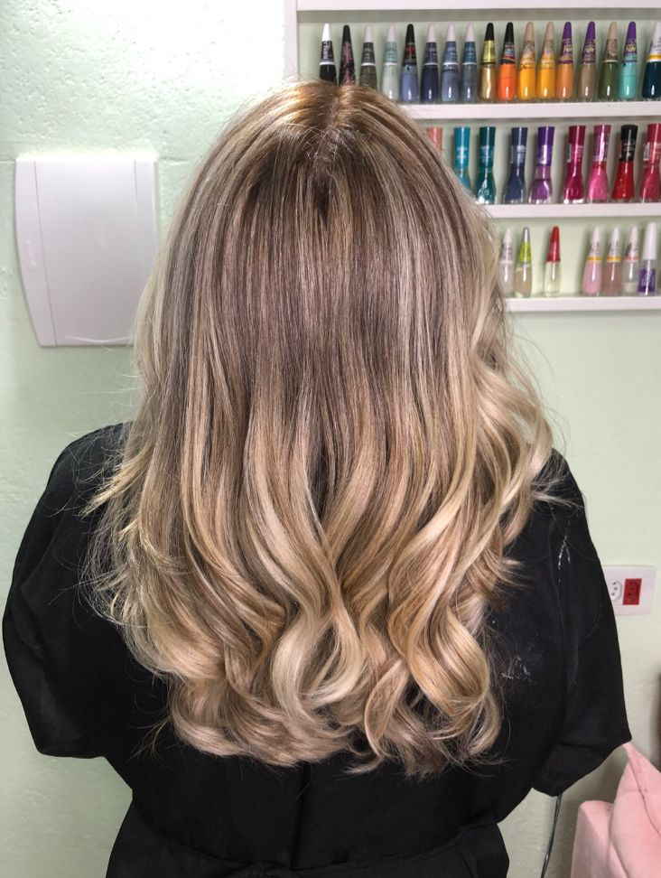
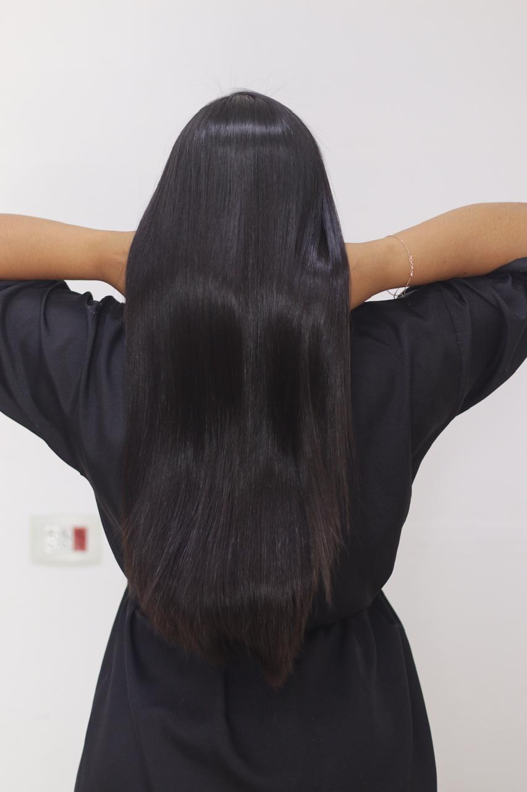

# 💇‍♀️ Salão Paraíso da Beleza

Projeto web desenvolvido para simular um site de salão de beleza, com foco em apresentação de serviços e prática de desenvolvimento front-end.

## 🚀 Funcionalidades

- Página inicial com apresentação do salão
- Exibição de serviços (coloração, mechas, alisamento)
- Layout responsivo
- Interface simples e intuitiva

## 🛠️ Tecnologias utilizadas

- HTML5
- CSS3
- JavaScript

## 📸 Demonstração





## ▶️ Como executar o projeto

1. Baixe o repositório:
```
git clone https://github.com/Ale995-oss/salao-paraiso-da-beleza.git
```
2. Acesse a pasta do projeto : cd salao-paraiso-da-beleza

3. Abra o arquivo ´index.html` no navegador


